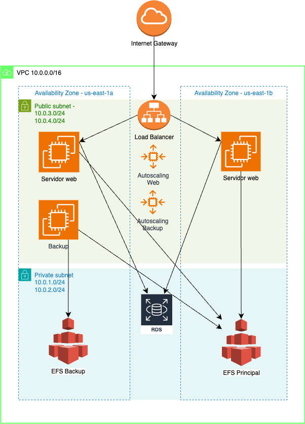

# Obligatorio de ISC - Primer Semestre - 2024 - Repositorio
### Autores:
#####     - Lucio Lastra    - 121447
#####     - Etzequiel Urman - 168879
#
### Fecha de entrega: 26/06/24  
#
## Guía

Hay dos carpetas:

1. **codigo-terraform** distintas versiones del código Terraform y la final.
2. **diagrama-arquitectura** diagramas en distintas versiones y el final.

Cada una de las carpetas contiene sub carpetas que estan organizadas por fecha.

Se ejecuta de la siguiente manera:
Debemos posicionarnos dentro de la carpeta codigo-terraform, una vez alli dentro debemos buscar la carpeta final.

Luego ejecutar los comandos.
- terraform validate
- terraform apply -var-file=09-Valores-Variables.tfvars aqui solicitará agregar la contraseña de la base de datos (a elección del usuario).

La solución se encuentra funcionando al 100% y tiene una demora en su implementación entre 10 y 15 minutos.

# Diagrama de solución final

Tenemos dos servidores web que se conectan al RDS y al EFS Principal, su función es alojar la pagina web y se conectan al EFS principal a modo ilustrativo.

Estos servidores están bajo un load balancer y bajo un autoscaling web que tiene una capacidad de mínimo 2 instancias, deseable 3 y máximo 5.

Luego, tenemos una instancia de backup cuya función es alojar datos dentro de un EFS backup que hace de espejo del EFS principal. Todo esto bajo un autoscaling que tiene una capacidad de mínimo 1, deseable 1 y máximo 2.

Tambien tenemos un RDS cuya función es alojar la base de datos (MySQL) de la pagina web (backend de los servidores web).

Contamos con un VPC principal donde se hace una división en 4 subredes, dos publicas y dos privadas, todas las subredes se alojan en dos availability zone. Para la salida a internet utilizamos un internet Gateway.
